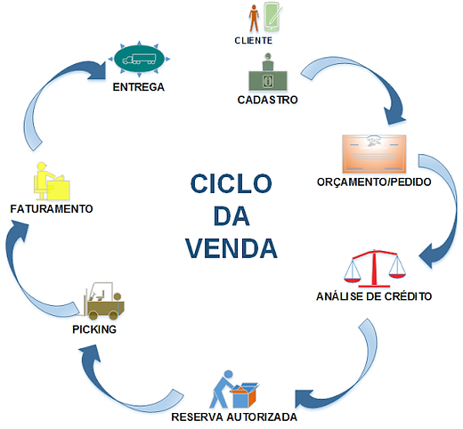

# Projeto Integrador - Modelo

Um modelo para o desenvolvimento do Projeto Integrador do Curso de Técnico em Desenvolvimento de Sistemas para a Internet Integrado ao Ensino Médio do IFC - Campus Araquari.

Professores: [Marco André Mendes](github.com/marcoandre) e [Alann Perini](https://github.com/AlannKPerini).

Links do projeto:

-   [Documentação (esse documento)](github.com/marcoandre/pi-modelo)
-   [Backend](github.com/marcoandre/pi-backend)
-   [Frontend](github.com/marcoandre/pi-frontend)

# Como usar esse modelo para o Projeto Integrador

1. Faça um fork desse repositório para a sua conta do GitHub.
2. Clone o repositório para o seu computador.
3. Abra o arquivo README.md no seu editor de texto favorito (recomendamos o [Visual Studio Code](https://code.visualstudio.com/)).
4. Tenha instalada a extensão [Markdown All in One](https://marketplace.visualstudio.com/items?itemName=yzhang.markdown-all-in-one) no seu editor de texto.
5. Edite o arquivo README.md com as informações do seu projeto.

# 1. Desenvolvimento

-   As equipes serão avaliadas por cada etapa da documentação e entregas realizadas.
-   Cada equipe deverá escolher um sistema para o desenvolvimento das atividades, a partir dos modelos apresentados.

## 1.1 Modelos de Sistemas

**Nessa parte a equipe deve escolher um dos modelos de sistemas para desenvolver o projeto. Ao escolher, escreva uma breve descrição do sistema e o motivo da escolha e pode apagar os outros modelos.**

### 1.1.1 Ponto de Vendas (PDV)

**Gerenciamento de vendas para uma padaria**

O nosso cliente, Sr. Genival, tem uma padaria de bairro chamada padaria Pão Genial e, devido a qualidade de seus produtos, ela está crescendo rapidamente. Recentemente, ele contratou mais funcionários para atendimento, caixa, panificação, etc.
Assim, atualmente, ele consegue concentrar seus esforços para melhorar a gestão da padaria. Para isso, ele quer instalar um sistema de controle de vendas que permita ao caixa lançar as vendas realizadas. Como sua intenção
é melhorar a gestão do negócio, é muito importante que ele consiga ter
relatórios, como por exemplo, de vendas.

### 1.1.2 Empréstimo

**Gerenciamento de uma biblioteca**

Uma ONG, chamada Sala Arco Íris, ajuda crianças de baixa renda em sua educação básica. Atualmente, recebeu uma doação de mais de 1000 livros e está montando a sua biblioteca. Eles querem emprestar os livros para as crianças e os pais das crianças. Apesar de
terem um computador e as estantes necessárias à disposição nessa nova biblioteca, não possuem verba suficiente para um leitor de impressão digital ou para produção
de carteirinhas para todas as crianças. Para isso, eles precisam de um sistema que gerencie todo o acervo, empréstimos, livros disponíveis, etc. mas que isso ocorra de maneira simples e sem necessidade de novos gastos. Também é importante que haja relatórios, permitindo o controle dos empréstimos e dos livros disponíveis no acervo.

### 1.1.3 Ordem de Serviço (O.S.)

**Manutenção de computadores**

Sr. Sálvio, nosso cliente, fez um curso de manutenção de celulares e smartphones e decidiu abrir um negócio no qual ele é responsável pelos consertos e sua esposa, Marília, realiza o atendimento aos clientes. Com sua visão empreendedora, ele sentiu a necessidade de um software que auxilie sua esposa nas tarefas diárias. Para isso, ele deseja um sistema que gerencie os clientes, orçamentos, serviços e retirada dos equipamentos. Sendo um negócio pequeno, é muito importante para ele conseguir ter relatórios que o ajudem na gestão da empresa, como o status dos serviços.

# 2. Situação Problema

**Nessa parte a equipe deve descrever a situação problema que será resolvida pelo sistema. O texto abaixo descreve o que essa etapa deve conter e pode ser apagado depois.**

Descrevem o que acontece atualmente na empresa em um contexto global,
abordando o funcionamento da empresa como um todo, não apenas os “problemas” que lá ocorrem.

Sabendo disso, seu papel é **detalhar o funcionamento da empresa escolhida na
atualidade, ou seja, antes de seu novo software**, usando como base a situação que passamos, mas aprofundando os detalhes de como as coisas acontecem.

-   Pesquise sobre empresas do ramo escolhido
    para entender como funcionam;
-   Aproveite seus conhecimentos previamente adquiridos na área da empresa que escolheu, se houver;
-   Simule uma situação real. Lembre-se que são
    propostas com empresas fictícias, sendo assim,
    você terá que tomar certas decisões sobre como
    a empresa funciona em relação às coisas que
    não estão definidas no documento base (por
    exemplo, no caso da padaria, dizemos que seu
    Genival contratou mais funcionários, mas saber
    quantos e o que fazem pode ser relevante para o software), então tente “visualizar” a
    empresa funcionando, como se você estivesse lá acompanhando o dia-a-dia;

Seguindo essas dicas, você deve ser capaz de descrever o dia-a-dia da empresa selecionada. E para ajudar na organização do texto, indicamos uma abordagem em 3 etapas:

-   **Introdução**: comece com um parágrafo apresentando a empresa (nome, o que faz, tempo de existência, o dono, funcionários,
    etc);
-   **Situação-problema**: Aborde em detalhes como a empresa funciona, procurando seguir uma
    ordem lógica dos acontecimentos e organizando parágrafos diferentes para cada coisa
    diferente que for explicar (como faria em uma redação);
-   **Conclusão**: tenha um parágrafo de conclusão focando nos problemas que você notou dentro da situação problema analisada e aponte brevemente como um software poderia
    ajudar a resolvê-los.

# 3. Descrição da proposta

Após entender o problema, proponha uma solução que será útil nos aspectos de dificuldade encontrados. Assim, aqui você deverá **explicar de maneira resumida, e preferencialmente mais textual, como o software funcionará**. Pense nesse texto como uma **introdução ao seu cliente** do que você pretende fazer por ele, para que ele confirme se realmente está dentro do
desejado e permita sua continuidade.

**Alguns pontos importantes a se destacar são:**

-   **Qual o foco de ação do software** relacionado com os problemas levantados na análise da situação-problema. O que realmente o software vai fazer. Por exemplo, o foco de ação do Gmail é permitir o envio e recebimento de e-mails.
-   **Os níveis de usuário do sistema**. Somente o gestor tem acesso? E os funcionários? Talvez seja para ambos, ou para funcionários de cargos
    diferentes, etc.
-   **O que poderá ser feito no software**.Apenas o principal, sem pensar em
    telas ou detalhes específicos, pois isso será feito em outro momento.
    -   **Se houver mais de um nível de usuário**, ressaltar as diferenças entre
        eles na descrição da proposta.

Tenha em mente que essa é uma etapa relativamente breve. Não é necessário um texto gigantesco, apenas dar uma noção do funcionamento do sistema. Mais adiante
precisaremos ser bem detalhistas, todavia agora a intenção é apenas fazer algo que permita ao cliente nos dizer se estamos no caminho certo.

# 4. Regras de negócio

**Nessa parte a equipe deve descrever as regras de negócio que serão implementadas no sistema. O texto abaixo descreve o que essa etapa deve conter e pode ser apagado depois.**

As **Regras de negócio** são orientações e restrições que ajudam a regular as operações de uma empresa. **Regras** foram criadas para **colaborar com o funcionamento**, seja da sociedade, de uma escola, de um jogo, etc. Não seria diferente nas organizações. Vamos abordar melhor sobre esse assunto. Entender o que são as
regras de negócio, sua importância, como são aplicadas e
automatizadas na gestão por processo.

## 4.1 O que são regras de negócio?

Um negócio funciona por processos que, por sua vez, são formados por atividades relacionadas entre si.

As funções das áreas de compras, estoque, logística, finanças, vendas e marketing, por exemplo, compõem um processo de fornecimento de um produto ao cliente.

Dentro desses processos, existem regras que devem ser seguidas durante a execução das atividades, que ajudam a definir **COMO** as operações devem ser realizadas e gerenciadas, **POR QUEM**, **QUANDO**, **ONDE** e **POR QUÊ**.

Podemos dizer que as regras de negócio são **limites impostos às operações**, de forma que elas sigam corretamente em direção às políticas e aos objetivos da instituição.

## 4.2 Regras para a criação de regras de negócio

De maneira geral, as regras de negócio devem:
- Ser **simples**, isto é,  ter apenas uma função.
- Ser **completas**, com início, meio e fim.
- Ser possíveis de **mensurar** e **rastrear**.
- Estar em consonância com a **legislação**.
- Estar **atualizadas** e sempre **revisadas**.
- Refletir a **política** e os **valores** da organização.
- Ser **inteligíveis** para os colaboradores e envolvidos no processo.

## 4.3 Por que ter regras de negócio?

- **Padronização de processos:** padronizam os processos e auxiliam a fluirem de forma mais eficiente e automatizada.
- **Controle de processos:** auxiliam no controle de processos, pois falhas são identificadas e corrigidas mais rapidamente.
- **Tomada de decisão:** auxiliam na tomada de decisão e no cumprimento de estratégias pré-estabelecidas.

## 4.4 Exemplos de regras de negócio

- Em um controle de qualidade de granja, pode-se dizer que a cada 100 ovos impróprios para consumo, o lote será descartado.
- Em um banco, clientes com faturamento mensal de mais de R$ 25 mil e CPF sem restrições, serão atendidos pelo gerente Premium pessoa física.
- Para conclusão de licitações, devem ser feitos três orçamentos e o vencedor será sempre o de menor preço final.
- Em um processo de seleção de RH, o candidato só pode ser aprovado se tiver mais de 5 anos de experiência na área, diploma de pós-graduação, espanhol fluente e pretensão salarial abaixo de R$ 8.000,00.
- Em um processo de vendas, o vendedor só pode vender um produto se o cliente tiver mais de 18 anos, renda familiar acima de R$ 5.000,00 e não tiver restrições no CPF.
- Em um processo de compras, o fornecedor só pode ser contratado se tiver nota fiscal, certificado de qualidade e preço abaixo de R$ 10,00 por unidade.
- Em um processo de logística, o pedido só pode ser enviado se o cliente tiver mais de 18 anos, endereço de entrega no mesmo estado e não tiver restrições no CPF.

## 4.5 Como escrever regras de negócio?

- Número identificador.
- Nome da regra.
- Data de criação e data da última alteração para comparações e
controle.
- Nome dos Autores das versões.
- Número da versão (1, 2 etc).
- Dependências: insira o identificador das regras atreladas, às quais a regra em questão depende.
- Uma descrição detalhada para compreensão da regra.

## 4.6 Exemplos de regras de negócio com formatação

- **RN01 – Criação Comanda:** Para iniciar um atendimento no balcão, é necessário primeiro abrir uma nova comanda.
- **RN02 – Inserir Produtos Comanda:** Para inserir um produto na comanda, é necessário que o produto esteja cadastrado no sistema e que a quantia comprada seja acima de zero.
- **RN03 – Cadastro de Leitores:** Os leitores precisam fazer o cadastro para realizar o empréstimo.
- **RN04 – Realizar Empréstimo:** Para realizar o empréstimo, apenas leitores com cadastro e nenhuma multa em aberto.
- **RN05 – Registro de Empréstimo:** O gerente deve possuir acesso aos registros de empréstimos.
- **RN06 – Pagamento de Multa:** O leitor que passar de 15 dias com o livro deverá pagar a multa de um real por dia de atraso.
- **RN07 – Impressão de Orçamento:** Com as informações do
orçamento registradas, a atendente deve imprimir o orçamento e
repassar ao cliente para aprovação, e caso o cliente aprovar, a atendente deve solicitar a sua assinatura para aprovar a execução do serviço.
- **RN08 – Abertura de OS:** Com o atendimento aprovado pelo cliente, a atendente deverá inserir os dados do cliente e do orçamento em um novo documento, para registros internos, realizando a abertura da OS.
- **RN09 – Relatório de Fluxo de Caixa:** O relatório de fluxo de caixa será permitido somente para o administrador.

